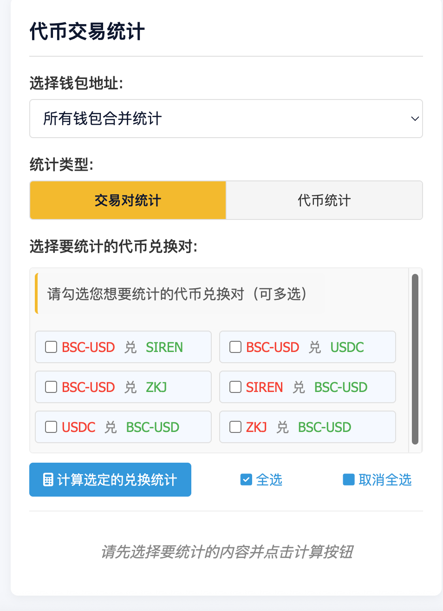

## Binance Alpha - Web Wallet Analyzer
这是一个基于网页的钱包交易分析工具，使用JavaScript、HTML和CSS实现，通过BscScan API从币安智能链(BSC)获取和分析钱包交易数据。

## 工具说明
> 工具已经适配手机端和PC端显示

### 支持功能
- [x] 多钱包的交易量统计
- [x] 支持交易对筛选统计
- [x] 支持查看每一条交易的链上数据，以确保统计的正确性

### 部分截图
> 工具支持对钱包代币交易对进行筛选统计，考虑到需要每个人刷的代币对不一样，特此设计了筛选统计，统计出来的是真实交易量，如果需要x2，请自行计算。
